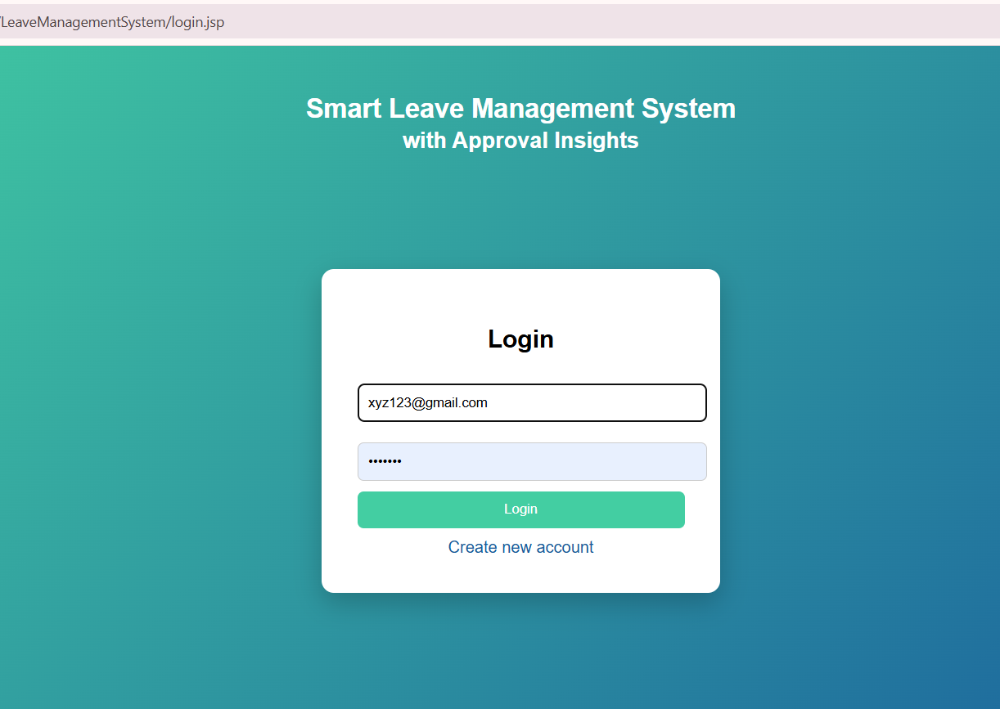
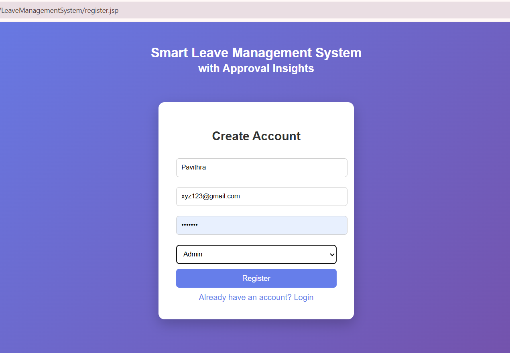
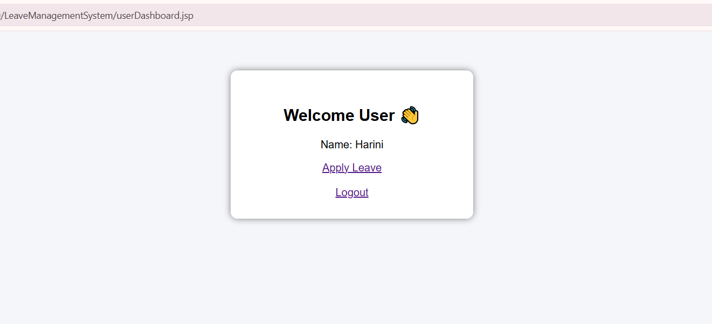
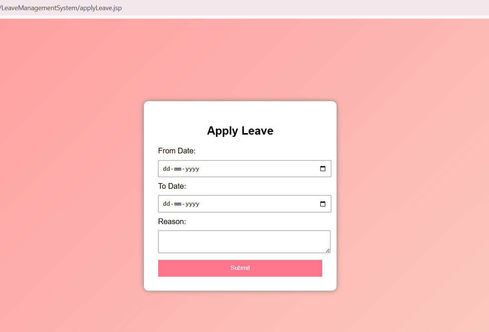
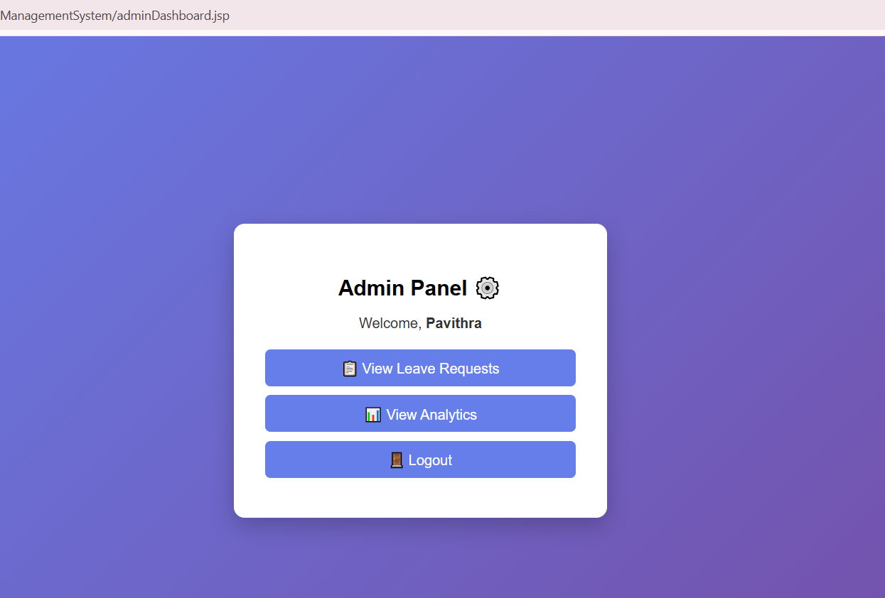
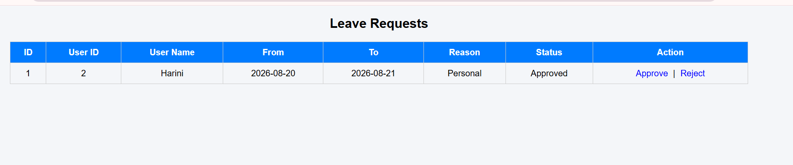
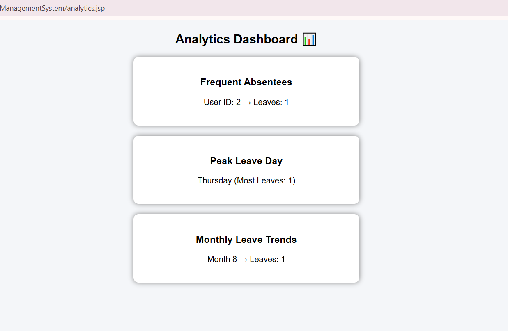

# Smart Leave Management System with Approval Insights
A Java-based web application designed to automate and simplify the leave management process. The system allows users to register, log in, apply for leave, and track their leave status, while administrators can review, approve, or reject leave requests. Built using Java Servlets, JSP, MySQL, JDBC, HTML, CSS, and Apache Tomcat.
The application also provides basic analytics and insights from leave data to support better decision-making.

## 🚀 Project Overview
Traditional leave management processes often rely on manual methods such as paperwork, spreadsheets, and email communication. These approaches can make maintaining records, tracking requests, and analyzing leave patterns difficult.

The **Smart Leave Management System** provides a centralized web-based platform that automates the leave application and approval workflow while maintaining organized leave records and providing basic analytical insights.

## 🎯 Objectives

- Automate the leave application and approval process
- Provide a centralized platform for managing leave requests
- Maintain organized user and leave records
- Allow users to track their leave status and history
- Enable administrators to approve or reject leave requests
- Provide basic analytics and leave-related insights
- Reduce manual effort and improve transparency

## ✨ Features

### 👤 User Module

- User registration
- User login and authentication
- Apply for leave
- Logout functionality

### 👨‍💼 Admin Module

- Admin login
- View submitted leave requests
- Review leave applications
- Approve leave requests
- Reject leave requests
- Monitor employee leave records

### 📊 Analytics & Insights

- View monthly leave trends
- Identify frequent absentee patterns
- Analyze peak leave days
- View leave request statistics
- Support basic decision-making through leave data insights

## 🛠️ Technology Stack

Java - Used for backend development and application logic
Java Servlets - Used for handling HTTP requests and implementing backend functionality
JSP - Used for creating dynamic web pages
HTML - Used for structuring the web pages
CSS - Used for styling and page layout
MySQL - Used for storing user and leave request data
JDBC - Used for connecting the Java application with MySQL
Apache Tomcat 9 - Used as the web application server
Git - Used for version control
GitHub - Used for source code management and project hosting

## 🏗️ System Architecture

The application follows a simple web application architecture.

User / Admin
      ↓
JSP + HTML + CSS
      ↓
Java Servlets
      ↓
    JDBC
      ↓
MySQL Database
      ↓
Apache Tomcat

### Architecture Components

Presentation Layer - JSP, HTML, and CSS
- Provides the user interface

Controller Layer - Java Servlets
- Handles user requests and application logic

Database Connectivity - JDBC
- Establishes communication between Java and MySQL

Database Layer - MySQL
- Stores user and leave request information

Application Server - Apache Tomcat 9
- Hosts and runs the web application

## 🗄️ Database Design

The application uses MySQL with the following tables:

### Users
Stores user registration, login, and role information.

Main fields:
- user_id
- name
- email
- password
- role

### Leave Requests
Stores leave applications and their approval status.

Main fields:
- leave_id
- user_id
- from_date
- to_date
- reason
- status

### Relationship
One user can submit multiple leave requests.

users (1) ──────────── (Many) leave_requests

## 🔄 Application Workflow

### User Workflow

Register
   ↓
Login
   ↓
User Dashboard
   ↓
Apply for Leave
   ↓
Leave Request Stored in Database
   ↓
Wait for Admin Decision

### Admin Workflow

Admin Login
   ↓
Admin Dashboard
   ↓
View Leave Requests
   ↓
Review Request
   ↓
Approve / Reject
   ↓
Leave Status Updated in Database

## 🚀 How to Run

### Requirements

- Java JDK
- Apache Tomcat 9
- MySQL Server
- MySQL Workbench
- Eclipse or Visual Studio Code

### Setup

1. Clone the repository.
2. Create a MySQL database named `leave_db`.
3. Create the required `users` and `leave_requests` tables.
4. Configure your local MySQL username and password using environment variables: `DB_USERNAME` and `DB_PASSWORD`.
5. Configure and deploy the project on Apache Tomcat 9.
6. Start the Tomcat server and open: `http://localhost:8080/LeaveManagementSystem/`

## 📸 Screenshots

### Login Page

### Registration Page

### User Dashboard

### Apply Leave

### Admin Dashboard

### Leave Requests

### Analytics

## 🔮 Future Enhancements

- View leave request status for users
- Add leave history for users
- Implement leave balance management
- Add email notifications for leave decisions
- Improve analytics and visualization
- Add stronger authentication and password security
- Develop a mobile version of the application

## Author

Pavithra A

Computer Science Engineering Student

GitHub: https://github.com/pavithraSHE
